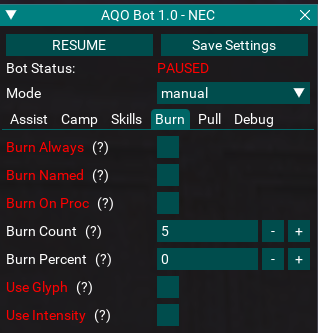

# aqobot

EverQuest class automation Lua scripts for MacroQuest.

 
 
 

## Description
Provides a CWTN-like interface for bard, necro, ranger, shadow knight and warrior (so far) class automation with assist and chase modes, pre-configured spells, discs, AAs and abilities to use, and a UI to control a handful of settings.

Each of the class files, `brd.lua`, `nec.lua`, `rng.lua`, `shd.lua` and `war.lua` includes a number of tables for spells, AAs, discs and items. Hopefully its clear from the naming which are for burns, which are standard rotations, mash abilities, etc.

## Documentation
This README isn't kept up to date, refer to the [docs](https://aquietone.github.io/docs/aqobot) instead.

## Installation
Copy the `aqo` folder into your MQ `lua` folder.

## Usage
Start the script: `/lua run aqo`

The script uses the same sort of command structure to the class plugins, using class shortname command bindings. For example:
- To set mode to manual: `/brd mode 0`
- To set mode to assist: `/brd mode 1`
- To set mode to chase: `/brd mode 2`
- To pause: `/nec pause on`
- To resume: `/nec pause off`
- To show the UI: `/rng show`
- To hide the UI: `/rng hide`
- To enable burns on demand: `/brd burnnow`

## Roadmap
Currently I'm just playing on EMU and haven't played live since the first few months of ToL, so for live nothing has changed since the first few classes added, nec, brd, shd, war, rng.
